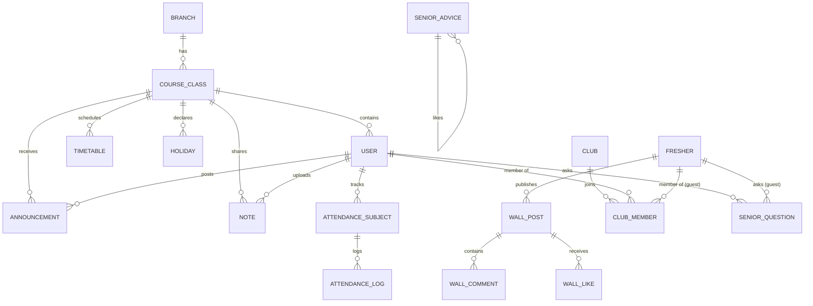

# 🏛️ PECverse / PEC Connect — Complete Backend Architecture, Data Models & Logic Specification

> **Target Audience:** AI Agents, LLMs, and Software Engineers.  
> **Purpose:** Authoritative reference for system architecture, data models, business logic engines, API contracts, security models, and operational gotchas.

---

## 1. System Overview & Technology Stack

| Layer | Technology | Key Details |
| :--- | :--- | :--- |
| **Framework** | Laravel 11.x (PHP 8.2+) | RESTful JSON API architecture |
| **Database** | MySQL / MariaDB (InnoDB) | Foreign key constraints, indexed searches |
| **Authentication** | Laravel Sanctum & Laravel Socialite | Google OAuth (`@pec.edu.in`) + Guest Device Tokens |
| **Push Notifications** | Expo Push Notification API | Token storage in `users` and `freshers` tables |
| **File Storage** | Laravel Storage / Public CDN | Notes & documents uploaded with direct download URLs |

---

## 2. Dual-Mode Identity & Auth Architecture

The backend serves two distinct student populations simultaneously:

```
                      ┌──────────────────────────────────────────────┐
                      │             PEC Connect Backend              │
                      └──────────────────────┬───────────────────────┘
                                             │
                    ┌────────────────────────┴────────────────────────┐
                    ▼                                                 ▼
     ┌─────────────────────────────┐                   ┌─────────────────────────────┐
     │   Authenticated Students    │                   │   Orientation / Freshers    │
     ├─────────────────────────────┤                   ├─────────────────────────────┤
     │ • Google OAuth (@pec.edu.in)│                   │ • Device ID (UUID)          │
     │ • Sanctum Bearer Token      │                   │ • No login required         │
     │ • Roles: student, cr, admin │                   │ • Scope: Freshers, Wall,    │
     │ • Scope: Full Academic Suite│                   │   Squads, Senior Advice     │
     └─────────────────────────────┘                   └─────────────────────────────┘
```

### A. Authenticated Students (`User` model)
* **Auth Endpoint:** `POST /api/auth/google` with Google OAuth `access_token`.
* **Domain Security:** Strictly restricted to emails ending with `@pec.edu.in`.
* **Roll Number Extraction:** Automatically parsed from Google Name string (e.g. `"bt25103008 Aditya Gupta"` ➔ `roll_no: "bt25103008"`, `name: "Aditya Gupta"`).
* **Role Hierarchy:**
  * `student`: Regular student (views timetables, notes, announcements, tracks personal attendance).
  * `cr`: Class Representative (manages class schedule, declares holidays, cancels/reschedules lectures, uploads notes, broadcasts announcements).
  * `superadmin`: Full administrative override permissions across all branches and classes.

### B. Freshers / Guests (`Fresher` model)
* **Identifier:** Hardware/App UUID (`device_id`) stored in device `AsyncStorage`.
* **Auth Endpoint:** `POST /api/freshers/register` (takes `name`, `branch`, `device_id`).
* **Lounge / Wall Anonymity:** Can toggle `is_anonymous: true`. Author names are dynamically masked as `"Fresher from [Branch]"`.

---

## 3. Database Schema & Relational Models (21 Models)



### Core Entity Breakdown

1. **`Branch`** (`id`, `name`, `code`): E.g. CSE, ECE, VLSI, MECH, CIVIL, EE.
2. **`CourseClass`** (`id`, `branch_id`, `year`, `group_name`): E.g. `CSE 2nd Year Group A`.
3. **`User`** (`id`, `name`, `email`, `role`, `class_id`, `roll_no`, `profile_photo`, `expo_push_token`).
4. **`Timetable`** (`id`, `class_id`, `type`, `day_of_week`, `date`, `start_time`, `end_time`, `subject`, `teacher`, `room`, `reason`, `period_no`, `original_timetable_id`):
   * `type`: `'weekly'` (routine template), `'single'` (extra class), `'cancelled'` (exception), `'rescheduled'` (exception).
5. **`Holiday`** (`id`, `class_id`, `date`, `reason`, `declared_by`):
   * `$casts = ['date' => 'date:Y-m-d']` guarantees ISO date format without timezone shift.
6. **`Announcement`** (`id`, `class_id`, `posted_by`, `title`, `body`, `created_at`).
7. **`AttendanceSubject`** (`id`, `user_id`, `name`, `target_percentage`, `attended_classes`, `bunked_classes`).
8. **`AttendanceLog`** (`id`, `user_id`, `attendance_subject_id`, `type: 'attended'|'bunked'`, `created_at`).
9. **`Note`** (`id`, `class_id`, `uploaded_by`, `title`, `subject`, `file_url`, `file_type`, `downloads_count`).
10. **`Mess` & `MessMenu`** (`id`, `day_of_week`, `meal_type: 'breakfast'|'lunch'|'snacks'|'dinner'`, `menu_items`).
11. **`Fresher`** (`id`, `device_id`, `name`, `branch`, `expo_push_token`).
12. **`WallPost`** (`id`, `fresher_id`, `content`, `likes_count`, `is_anonymous`, `created_at`).
13. **`WallComment`** (`id`, `wall_post_id`, `fresher_id`, `content`, `is_anonymous`, `created_at`).
14. **`WallLike`** (`id`, `device_id`, `likable_type`, `likable_id`).
15. **`ReportedPost`** (`id`, `reporter_device_id`, `wall_post_id`, `reason`).
16. **`BlockedUser`** (`id`, `blocker_device_id`, `blocked_device_id`).
17. **`Club`** (`id`, `name`, `code`, `category: 'technical'|'cultural'|'sports'|'social'`, `description`, `members_count`, `icon_name`, `color`, `instagram_handle`).
18. **`ClubMember`** (`id`, `club_id`, `user_id`, `device_id`): Polymorphic-style membership supporting both authenticated users and guest freshers.
19. **`SeniorAdvice`** (`id`, `title`, `category`, `content`, `author_name`, `author_batch`, `likes_count`).
20. **`SeniorQuestion`** (`id`, `user_id`, `device_id`, `question`, `answer`, `status: 'pending'|'answered'`).

---

## 4. Core Business Engines & Implementation Logic

### Engine 1: Dynamic Timetable & Holiday Exception Resolution
* **Endpoint:** `GET /api/timetables`
* **Response Shape:** `{ classes: [...], holidays: [...] }`
* **Resolution Algorithm on Client / Server:**
  1. Base weekly classes (`type == 'weekly'`) are matched by Day of Week (`1 = Mon ... 7 = Sun`).
  2. Single extra classes (`type == 'single'`) are matched by exact Date (`date == 'YYYY-MM-DD'`).
  3. Exceptions (`type == 'cancelled' | 'rescheduled'`) override the original lecture with `original_timetable_id == id`.
  4. Active Holidays (`holidays.some(h => h.date == targetDate)`): When active, suppresses all classes and displays the Holiday Banner with the declaration reason.
* **Auto-Announcements:**
  * When a CR creates a class, deletes a class, declares a holiday, or cancels/reschedules a lecture, the backend **automatically generates a formatted Markdown announcement** in `announcements` table visible to all classmates.

### Engine 2: Attendance Tracking & Zero-Drift Auditing
* **Endpoints:** `POST /api/attendance/{id}/log`, `DELETE /api/attendance/log/{logId}`, `POST /api/attendance/{id}/reset`
* **Zero-Drift Guarantee:** Attendance counts (`attended_classes`, `bunked_classes`) are **recalculated from raw transaction logs** inside a DB Transaction (`DB::transaction`) on every log/delete rather than naive `+1` / `-1` math.
* **Bunk Target Calculation Formula:**
  $$\text{Current \%} = \frac{\text{Attended}}{\text{Attended} + \text{Bunked}} \times 100$$
  $$\text{Max Safe Bunks} = \left\lfloor \frac{\text{Attended} - (\text{Target\%} \times \text{Total})}{1 - \text{Target\%}} \right\rfloor$$

### Engine 3: Freshers Lounge & Community Moderation
* **Rate Limiting:** Public POST endpoints (`/api/wall`, `/api/wall/{id}/comments`, `/api/wall/{id}/like`) are throttled to `10 requests/minute` per IP/device (`throttle:10,1`).
* **Content Filtering:**
  * Automatic blacklist moderation for abusive words.
  * 3 unique reports automatically soft-delete/flag posts.
  * Device-level blocking: `BlockedUser` table automatically excludes blocked author device IDs from the post feed (`whereNotIn('device_id', $blockedIds)`).

### Engine 4: Squads & Senior Advice
* **Toggle Join Idempotency (`POST /api/clubs/{id}/toggle-join`):**
  * Checks if `user_id` or `device_id` already exists in `club_members`.
  * If joined: deletes pivot and atomically decrements `members_count` (`$club->decrement('members_count')`).
  * If not joined: creates pivot and atomically increments `members_count` (`$club->increment('members_count')`).

---

## 5. Complete API Contract Sitemap

### 🌐 Public Endpoints

| Method | URI | Description | Parameters / Payload |
| :--- | :--- | :--- | :--- |
| `POST` | `/api/auth/google` | Exchange Google OAuth access token for Sanctum token | `{ token: string }` |
| `POST` | `/api/auth/guest` | Demo/Reviewer login bypass | None |
| `POST` | `/api/freshers/register` | Register fresher profile | `{ name: string, branch: string, device_id: string }` |
| `GET` | `/api/freshers/profile/{device_id}` | Get fresher stats & info | `device_id` |
| `GET` | `/api/freshers/stats` | Total freshers count & activity | None |
| `POST` | `/api/freshers/push-token` | Register push token for guest | `{ token: string, device_id: string }` |
| `GET` | `/api/wall` | Fetch Lounge feed | `?sort=new\|hot&device_id=...` |
| `POST` | `/api/wall` | Post to Lounge | `{ content: string, device_id: string, is_anonymous: bool }` |
| `POST` | `/api/wall/{id}/like` | Toggle like on post | `{ device_id: string }` |
| `GET` | `/api/wall/{id}/comments`| Get comments for a post | None |
| `POST` | `/api/wall/{id}/comments`| Add comment | `{ content: string, device_id: string, is_anonymous: bool }` |
| `POST` | `/api/wall/{id}/report` | Report post | `{ reason: string, device_id: string }` |
| `POST` | `/api/wall/{id}/block` | Block user by device | `{ blocked_device_id: string, device_id: string }` |
| `GET` | `/api/clubs` | List clubs & membership status | `?category=...&device_id=...` |
| `POST` | `/api/clubs/{id}/toggle-join` | Join / Leave squad | `{ device_id?: string }` |
| `GET` | `/api/senior-advice` | Fetch senior survival advice | `?category=...` |
| `POST` | `/api/senior-advice/{id}/like` | Upvote advice card | None |
| `POST` | `/api/senior-advice/questions`| Submit anonymous senior question | `{ question: string, device_id?: string }` |
| `GET` | `/api/senior-advice/questions`| Get answered questions | None |

### 🔒 Authenticated Endpoints (`auth:sanctum`)

| Method | URI | Description | Parameters / Payload |
| :--- | :--- | :--- | :--- |
| `POST` | `/api/auth/logout` | Revoke active Sanctum token | None |
| `GET` | `/api/user/profile` | Get current user + Class + Branch | None |
| `PUT` | `/api/user/class` | Update user class / branch | `{ class_id: int }` |
| `POST` | `/api/user/push-token` | Register user push notification token | `{ token: string }` |
| `GET` | `/api/branches` | List all academic branches | None |
| `GET` | `/api/classes` | List all class groups for branch | None |
| `GET` | `/api/timetables` | Get weekly schedule + exceptions + holidays | None |
| `POST` | `/api/timetables` | Schedule new lecture (CR only) | `{ type, day_of_week, start_time, end_time, subject, room, teacher }` |
| `PUT` | `/api/timetables/{id}` | Update permanent lecture (CR only) | `{ start_time, end_time, subject, room, teacher }` |
| `DELETE`| `/api/timetables/{id}` | Permanently remove lecture (CR only)| None |
| `POST` | `/api/timetables/exceptions` | Cancel / Reschedule single lecture | `{ timetable_id, date, type: 'cancelled'\|'rescheduled', reason, ... }` |
| `POST` | `/api/timetables/holiday` | Declare class holiday (CR only) | `{ date: 'YYYY-MM-DD', reason: string }` |
| `DELETE`| `/api/timetables/holiday/{id}`| Cancel declared holiday (CR only) | None |
| `GET` | `/api/announcements` | Fetch class announcements | None |
| `POST` | `/api/announcements` | Broadcast announcement (CR only) | `{ title: string, body: string }` |
| `DELETE`| `/api/announcements/{id}` | Delete announcement (CR only) | None |
| `GET` | `/api/attendance` | Fetch all tracked subjects + logs | None |
| `POST` | `/api/attendance` | Add new subject to tracker | `{ name: string, target_percentage: int }` |
| `PATCH` | `/api/attendance/{id}` | Update subject name / target % | `{ name?: string, target_percentage?: int }` |
| `POST` | `/api/attendance/{id}/log` | Log attendance event | `{ type: 'attended' \| 'bunked' }` |
| `DELETE`| `/api/attendance/log/{logId}` | Undo / delete log entry | None |
| `POST` | `/api/attendance/{id}/reset` | Reset attendance counts to 0 | None |
| `DELETE`| `/api/attendance/{id}` | Delete tracked subject | None |
| `GET` | `/api/notes` | Get study materials for user class | `?subject=...` |
| `POST` | `/api/notes` | Upload note / document (CR only) | `{ title, subject, file_url, file_type }` |
| `POST` | `/api/notes/{id}/download` | Track note download count | None |
| `DELETE`| `/api/notes/{id}` | Delete note (CR only) | None |
| `GET` | `/api/mess/menu` | Get weekly hostel mess menu | None |

---

## 6. Seeders & Reference Master Data

To populate or reset the database cleanly, run:

```bash
php artisan migrate:fresh --seed
```

### Seeders Executed in Sequence:
1. `AdminSeeder`: Superadmin and demo CR test accounts.
2. `PecCse3rdSemSeeder`: CSE 3rd semester official timetable routines.
3. `PecCseAi3rdSemSeeder`: CSE-AI 3rd semester timetable routines.
4. `PecMech3rdSemSeeder`: Mechanical 3rd semester timetable routines.
5. `PecCivil3rdSemSeeder`: Civil 3rd semester timetable routines.
6. `PecVlsi3rdSemSeeder`: 100% accurate VLSI 3rd semester timetable routines.
7. `MessSeeder`: Standard 7-day 4-meal hostel mess menu.
8. `PecClubsSeeder`: 9 official PEC societies (GDSC, Coding Club, Robotics, Aarohan, Enactus, Dramatics, Sports, Design, E-Sports).
9. `PecSeniorAdviceSeeder`: 5 practical senior survival guides.

---

## 7. Critical Rules for Future AI Agents & LLMs

1. **Date Parameter Invariant:**
   * Always format timetable and holiday dates as **`YYYY-MM-DD`** using local date components (`getFullYear()`, `getMonth() + 1`, `getDate()`). **Never** use `toISOString().split('T')[0]` on client devices to prevent UTC timezone date shifting.
2. **Timetable Date-Wise Querying:**
   * The client must always query date-wise (`DateRibbon` with 21-day window) to allow date-specific holiday and exception matching.
3. **No Direct `+1` / `-1` Math on Attendance:**
   * Never update `attended_classes` or `bunked_classes` directly in database rows without creating an `AttendanceLog` record to maintain audit integrity.
4. **PowerShell Windows CLI Rule:**
   * On Windows host machines, execute CLI commands directly through `npx.cmd` or native binaries (`php artisan ...`) rather than raw `.ps1` wrapper scripts.
5. **OTA Deployment Rule:**
   * When publishing EAS production updates, always supply `--environment production --non-interactive`.
